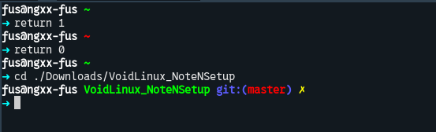
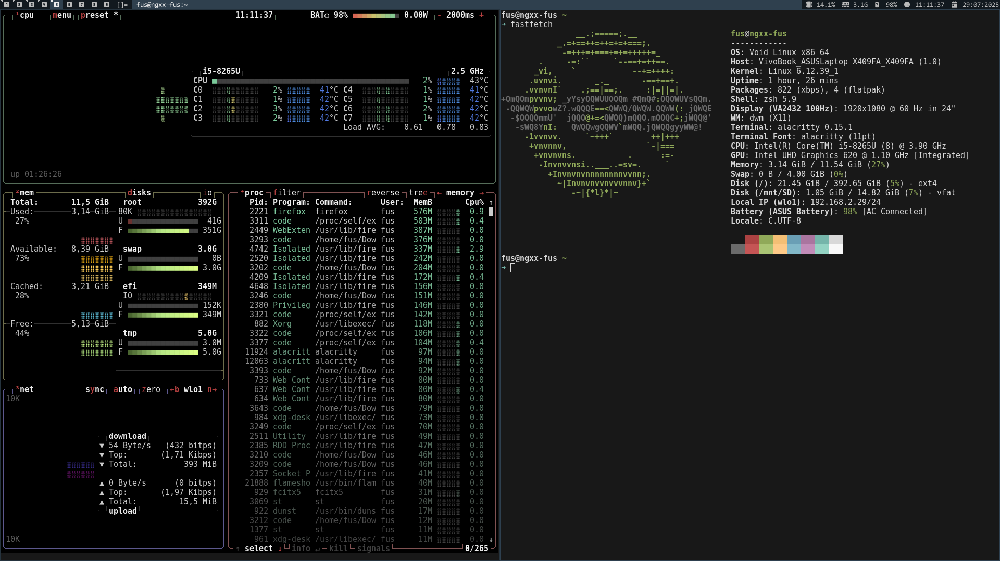

# Installaltions

## HW (Hardware) repair

- USB (>=4GB).
- Live-image [https://voidlinux.org/download/](https://voidlinux.org/download/).
- Linux OS (I have installed VoidLinux from UBUNTU).
- USB Windows Installation (For Failed Install Attempts).

## Prepare Installation Media

* SOURCE: [Prepare Installation Media](https://docs.voidlinux.org/installation/live-images/prep.html)

(This part just make a USB LIVE IMAGE)

## Boot from USB LIVE-IMAGE 

### BASH

Void Linux installation only provides a command-line interface (CLI). For a more comfortable experience, you can use `Bash` by typing `bash` in the shell.

### Void-Installer

run `void-installer` to start install VoidLinux.

### Parition notes

SOURCE: [https://docs.voidlinux.org/installation/live-images/partitions.html](https://docs.voidlinux.org/installation/live-images/partitions.html)

This is your free disk:

    [-----------------------------------------]

My recommend:

    [--EFI:250MB---|--SWAP:4GB--|--ROOT(/)----]

### To be cont. :>

# THIS REPO

Back-up tree:

```
├── etc
│   └── acpi
│       └── handler.sh
├── home
│   └── fus
│       ├── .backup.sh
│       ├── .config
│       └── .fus
├── readme.md
└── usr
    └── share
        └── fonts
```

# VoidLinux NOTE - Right after the first boot

## Utils & Tools

Some tools and utils u need to install.

```Zsh
#!/bin/sh
# =============================================================================
# Essential system tools
# =============================================================================
# Modern system monitor (like top/htop but more user-friendly)
sudo xbps-install -Sy btop
# Power and battery info (useful for laptops, also used by status bars like dwmblocks)
sudo xbps-install -Sy upower
# D-Bus message bus (used by many graphical applications for interprocess communication)
sudo xbps-install -Sy dbus
# elogind handles user sessions and power management (needed by DWM for logout, reboot, suspend)
sudo xbps-install -Sy elogind
# udisks2 allows disk management and automount (used by file managers like Thunar, PCManFM)
sudo xbps-install -Sy udisks2
# ACPI daemon handles power button, lid switch, sleep key events
sudo xbps-install -Sy acpid
# Clipboard access (used in CLI tools and DWM configs to copy/paste)
sudo xbps-install -Sy xclip
# Network management daemon and CLI tool (enables nmcli and GUI frontends like nmtui)
sudo xbps-install -Sy NetworkManager
# =============================================================================
# UI & appearance tools
# =============================================================================
# Lightweight notification daemon (used with notify-send or status scripts)
sudo xbps-install -Sy dunst
# Wallpaper manager and image viewer (common in DWM/X11 to set backgrounds)
sudo xbps-install -Sy feh
# Fast terminal-based system fetcher (alternative to neofetch)
sudo xbps-install -Sy fastfetch
# xdg-utils provides tools like xdg-open, xdg-mime to open files/URLs with default apps
sudo xbps-install -Sy xdg-utils
# =============================================================================
# Development tools
# =============================================================================
# GNU Compiler Collection (gcc), Make, Autoconf — required for building most software
sudo xbps-install -Sy gcc make autoconf
# ripgrep: fast recursive grep tool (used for code search and scripting)
sudo xbps-install -Sy ripgrep
# Git: essential version control system (used to clone and manage source code, e.g. suckless)
sudo xbps-install -Sy git
# =============================================================================
# Internet tools
# =============================================================================
# curl: fetch files over HTTP(S), used in many install scripts and APIs
sudo xbps-install -Sy curl
# Web browser (you can choose your own; Firefox is reliable and compatible with most sites)
sudo xbps-install -Sy firefox
# =============================================================================
# Terminal emulator
# =============================================================================
# GPU-accelerated modern terminal emulator (used instead of xterm or st)
sudo xbps-install -Sy alacritty

```

## Zsh/Oh-my-zsh

ZSH is modern shell that save your time in your work; oh-my-zsh help your Terminal look prety with some helpful plugins.

### Install ZSH

```Bash
sudo xbps-install -Sy xbps  # At 1st time (1st boot of VoidLinux)
sudo xbps-install -Suy      # Update system, repo (for long-time not update)
sudo xbps-install -Sy zsh   # Install zsh
```

### Install OH-MY-ZSH

**DEP**: curl

```Zsh
sh -c "$(curl -fsSL https://raw.githubusercontent.com/ohmyzsh/ohmyzsh/master/tools/install.sh)"
```

My custom them (just edit default theme):

```Zsh
PROMPT='%{$fg_bold[white]%}%n@%m%{$reset_color%} %(?:%{$fg_bold[green]%}%c:%{$fg_bold[red]%}%c) %{$reset_color%}$(git_prompt_info)
%{$fg_bold[cyan]%}➜ %{$reset_color%}'

ZSH_THEME_GIT_PROMPT_PREFIX="%{$fg_bold[blue]%}git:(%{$fg[red]%}"
ZSH_THEME_GIT_PROMPT_SUFFIX="%{$reset_color%} "
ZSH_THEME_GIT_PROMPT_DIRTY="%{$fg[blue]%}) %{$fg[yellow]%}%1{✗%}"
ZSH_THEME_GIT_PROMPT_CLEAN="%{$fg[blue]%})"
```

Preview:



## Fater with Alias 

You should use aliases to speed up your work in the CLI. E.g:

```Zsh
##### -l for more info 
##### -a for all file (includes hidden files)
##### -t time order
####  -C List files in columns,
####  -F marking types (-F, e.g., / for dirs, * for executables)
alias ll="ls -CFlta"
alias la="ls -CFat"
alias l='ls -CF'
##### quick install app
alias s="sudo xbps-install -S"
alias i="sudo xbps-install -Sy"
alias u="sudo xbps-install -Suy"
alias r="sudo xbps-remove -y"
alias q="sudo xbps-query -Rs"
##### quick directory jump 
alias downloads='cd ~/Downloads'
alias desktop='cd ~/Desktop'
alias tmp='cd /tmp'
alias desktop="cd ~/Desktop"
##### git
alias clone='git clone'
alias push='git push'
alias addall='git add -A'
alias commit='git commit'
alias commitmsg='git commit -m '
##### quick edit zshrc
alias zshrc="nvim ~/.zshrc"
```

P/S: My [.zshrc](home/fus/.zshrc) and my [shell_utils.sh](home/fus/.fus/shell_utils.sh)

```Zsh
export ZSH="$HOME/.oh-my-zsh"
ZSH_THEME="robbyrussell"
plugins=(git)

source $ZSH/oh-my-zsh.sh

source /home/fus/.fus/shell_utils.sh
source /home/fus/.fus/alias
```

# VoidLinux/DWM NOTE - Right after the first boot

## My words

I have make `.Display` directory to store DWM, ST, DWM-Blocks.

```Bash
.Display
├── dmenu           # Search, Start app
├── dwm             # Window manager
├── dwmblocks       # Manage status bar
└── st              # Simple Terminal (Stuck :v, it have change to `alacritty`)
```

## Xorg

Xorg (or X.Org Server) is the open-source implementation of the X Window System, which provides the graphical display layer on Unix-like operating systems (Linux, BSD, etc.).

```Zsh
i xorg xinit xrandr
```

**DRIVER:**
```Zsh
i xf86-video-intel
```

## DWM

`dwm` is a dynamic window manager for X. It supports tiled, monocle, and floating layouts, all of which can be switched dynamically. Any configuration changes require recompiling the source.

### Dependencies

```Zsh
i git make gcc pkg-config libX11-devel libXft-devel libXinerama-devel
```

### Clone from Github

```Zsh
git clone https://github.com/Digital-Chaos/dwm.git
```

### Build & Install

```Zsh
cd dwm
make
sudo install
```

### Sound/Brightness nofi

I found that all `acpi` signals is handle by [handler.sh](etc/acpi/handler.sh). You can set noti by using xsetroot. E.g:

```Zsh
write_noti() {
    local msg="$*"
    su - fus -c "DISPLAY=:0 xsetroot -name '$msg'" &
}
```

## DWM-Block

Same with DWM, clone, edit, build, install (copy). But i found a little bug on Makefile, blocks.def.h will copy and rename to blocks.h, but make clean not remove old blocks.h, hence new config is not applied.

```Zsh
git clone https://github.com/torrinfail/dwmblocks.git
cd dwmblocks
make
sudo make install
```
**FIX Makefile (OLD)**
```Makefile
blocks.h:
	cp blocks.def.h $@

clean:
	rm -f *.o *.gch dwmblocks
```
**FIX Makefile (NEW)**
```Makefile
blocks.h:
	cp blocks.def.h $@

clean:
	rm -f *.o *.gch dwmblocks blocks.h
```

P/S: DWMBLOCKS-blocks.def.h

```
static const Block blocks[] = {
    /* Icon   */    /* Command */                                                                                      /* Interval */    /* Signal */
    { "   ",      "top -bn1 | awk '/^%Cpu/ { printf \"%.1f%%\\n\", 100 - $8 }'",                                      1,              0 },
    { "   ",      "free -h | awk '/^Mem/ { print $3 }' | sed 's/i//g'",                                               1,              0 },
    { " 󰂑  ",      "echo \"$(cat /sys/class/power_supply/BAT0/capacity)%\"",                                          15,             0 },
    { " 󰥔  ",      "date '+%H:%M:%S'",                                                                                1,              0 },
    { "   ",      "date '+%d:%m:%Y'",                                                                                1,              0 },
};
```

## Build & Install DWM, DWMBlocks, ST, DMENU

I have written a script - [update_dwm.sh](home/fus/.fus/update_dwm.sh) build and install DWM, DWM-BLOCKS, ST, DMENU.

## NetworkManager

It's a command-line tool used to control and monitor NetworkManager, a system service that manages network connections.

### Install NetworkManager

```Zsh
sudo xbps-install -Sy NetworkManager
```

### Enable and Start service

```Zsh
sudo ln -s /etc/sv/NetworkManager /var/service
```

### Check service

```Zsh
sudo sv status NetworkManager
```

### Error: Error: 802-11-wireless-security.key-mgmt: property is missing.

FIX: add ```--ask```
```Zsh
sudo nmcli device wifi connect XXXXXXXXX --ask
sudo nmcli device wifi connect XXXXXXXXX password XXXXXXXXX
```

## DNS Server

Edit `/etc/resolv.conf`

```conf
# Generated by dhcpcd from wlo1.dhcp, wlo1.dhcp6, wlo1.ra
# /etc/resolv.conf.head can replace this line
nameserver 1.1.1.1
nameserver 8.8.8.8
# nameserver 192.168.2.253
# nameserver fe80::1%wlo1
# nameserver 2402:800:20ff:109c::1
# nameserver 2402:800:20ff:5555::1
# nameserver fe80::2a77:77ff:fea8:3868%wlo1
# /etc/resolv.conf.tail can replace this line
```

## Swap L/R-Mouse

Make rule at `/etc/X11/xorg.conf.d/90-mouse-swap.conf`

```conf
Section "InputClass"
    Identifier "Swap Mouse Buttons"
    MatchIsPointer "on"
    Option "ButtonMapping" "3 2 1"
EndSection
```

## To be cont.

# Final DEMO



