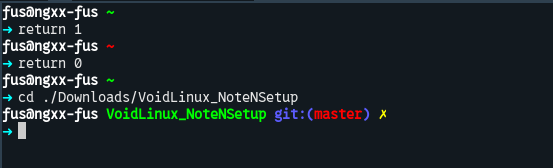

# Installaltions

## HW (Hardware) repair

- USB (>=4GB)
- Live-image [https://voidlinux.org/download/](https://voidlinux.org/download/)
- Linux OS (I have installed VoidLinux from UBUNTU)
- USB-Windows-Installation (For failing installation) HAHAHAHA.

## Prepare Installation Media

* SOURCE: [Prepare Installation Media](https://docs.voidlinux.org/installation/live-images/prep.html)

(This part just make a USB LIVE IMAGE)

## Boot from USB LIVE-IMAGE 

### BASH

Void Linux installation only provides a command-line interface (CLI). For a more comfortable experience, you can use `Bash` by typing `bash` in the shell.

### Void-Installer

run `void-installer` to start install VoidLinux.

### Parition notes

SOURCE: [https://docs.voidlinux.org/installation/live-images/partitions.html](https://docs.voidlinux.org/installation/live-images/partitions.html)

This is your free disk:

    [-----------------------------------------]

My recommend:

    [--EFI:250MB---|--SWAP:4GB--|--ROOT(/)----]

### To be cont. :>

# THIS REPO

Back-up tree:

```
├── etc
│   └── acpi
│       └── handler.sh
├── home
│   └── fus
│       ├── .backup.sh
│       ├── .config
│       └── .fus
├── readme.md
└── usr
    └── share
        └── fonts
```

# VoidLinux NOTE - Right after the first boot

## Zsh/Oh-my-zsh

ZSH is modern shell that save your time in your work; oh-my-zsh help your Terminal look prety with some helpful plugins.

### Install ZSH

```Bash
sudo xbps-install -Sy xbps  # At 1st time (1st boot of VoidLinux)
sudo xbps-install -Suy      # Update system, repo (for long-time not update)
sudo xbps-install -Sy zsh   # Install zsh
```

### Install OH-MY-ZSH

```Zsh
sh -c "$(curl -fsSL https://raw.githubusercontent.com/ohmyzsh/ohmyzsh/master/tools/install.sh)"
```

My custom them (just edit default theme):

```Zsh
PROMPT='%{$fg_bold[white]%}%n@%m%{$reset_color%} %(?:%{$fg_bold[green]%}%c:%{$fg_bold[red]%}%c) %{$reset_color%}$(git_prompt_info)
%{$fg_bold[cyan]%}➜ %{$reset_color%}'

ZSH_THEME_GIT_PROMPT_PREFIX="%{$fg_bold[blue]%}git:(%{$fg[red]%}"
ZSH_THEME_GIT_PROMPT_SUFFIX="%{$reset_color%} "
ZSH_THEME_GIT_PROMPT_DIRTY="%{$fg[blue]%}) %{$fg[yellow]%}%1{✗%}"
ZSH_THEME_GIT_PROMPT_CLEAN="%{$fg[blue]%})"
```

Preview:



## Fater with Alias 

You should use aliases to speed up your work in the CLI. E.g:

```Zsh
##### -l for more info 
##### -a for all file (includes hidden files)
##### -t time order
####  -C List files in columns,
####  -F marking types (-F, e.g., / for dirs, * for executables)
alias ll="ls -CFlta"
alias la="ls -CFat"
alias l='ls -CF'
##### quick install app
alias s="sudo xbps-install -S"
alias i="sudo xbps-install -Sy"
alias u="sudo xbps-install -Suy"
alias r="sudo xbps-remove -y"
alias q="sudo xbps-query -Rs"
##### quick directory jump 
alias downloads='cd ~/Downloads'
alias desktop='cd ~/Desktop'
alias tmp='cd /tmp'
alias desktop="cd ~/Desktop"
##### git
alias clone='git clone'
alias push='git push'
alias addall='git add -A'
alias commit='git commit'
alias commitmsg='git commit -m '
##### quick edit zshrc
alias zshrc="nvim ~/.zshrc"
```

P/S: My [.zshrc](home/fus/.zshrc) and my [shell_utils.sh](home/fus/.fus/shell_utils.sh)

```Zsh
export ZSH="$HOME/.oh-my-zsh"
ZSH_THEME="robbyrussell"
plugins=(git)

source $ZSH/oh-my-zsh.sh

source /home/fus/.fus/shell_utils.sh
source /home/fus/.fus/alias
```
