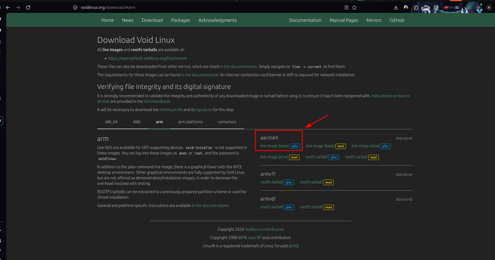
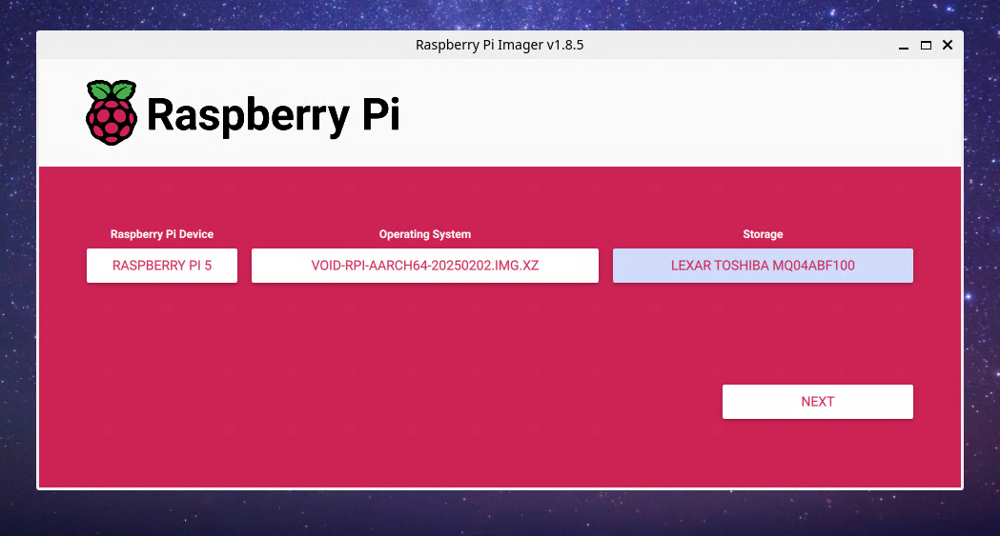

# VoidLinux on RPi5

## Introduction

Hi there! This update on branch `Update-2026.08` covers installation steps, notes, and utilities for setting up Void Linux on a Raspberry Pi 5 (4GB RAM, 256GB SSD).

Most of the setup remains the same as the previous configuration on `master`.

**NOTE**: This README is not a comprehensive installation guide; it is simply a set of personal notes taken during and after installing Void Linux, heavily based on my own experience. Please read carefully and ensure you have basic knowledge and experience in installing Linux distributions. 

## Download VoidLinux `image`



## Flash into `SSD storage` / `SD card`



## First packages

### Login as `root`

After boot, the login screen will appear, you can login with the default login info:

- username: `root`
- password: `voidlinux`

### Update system

The first package you need to update is `xbps`.

```shell
iy xbps
iuy
```

### Install tools/utils

I will manually type alias for quick command line later.

```shell
alias i="xbps-install -Sy"
```

Now, you can install a package with `i`. More convinience.

Some packages always in my mind when I start work with a Linux system.

```shell
i btop      # system profiling
i duf       # disk check
i git       # version control
i vim       # vim editor (neo-vim will be installed later)
i curl      # tool for download file
i wget      # tool for download file
```

### More tools/utils

This list come from previous `readme.md` I have made when I install VoidLinux on my Asus laptop.

```shell
#!/bin/sh
# =============================================================================
# Essential system tools
# =============================================================================
# btop: modern resource monitor with mouse support and beautiful TUI (like htop but better)
sudo iy btop
# upower: provides battery and power statistics for laptops; used by status bars like dwmblocks
sudo iy upower
# dbus: essential message bus system for communication between desktop apps and services
sudo iy dbus
# elogind: manages user sessions and permissions (needed for shutdown, suspend, logout in DWM)
sudo iy elogind
# udisks2: allows safe mounting/unmounting of USB drives and disks; needed by GUI file managers
sudo iy udisks2
# acpid: listens to ACPI events (lid close, power button); used for laptop power handling
sudo iy acpid
# xclip: access X11 clipboard from terminal (used in screenshot scripts, copy-paste from CLI)
sudo iy xclip
# xdotool: simulate keyboard and mouse input, window movement, and other X11 actions
sudo iy xdotool
# maim: fast screenshot tool (like `scrot`, supports selection and automation with `xdotool`)
# scrot: simple screenshot tool (less modern but widely supported and scriptable)
sudo iy maim scrot
# NetworkManager: universal network configuration daemon; works with `nmtui`, `nmcli`, and GUIs
sudo iy NetworkManager
# =============================================================================
# UI & appearance tools
# =============================================================================
# dunst: lightweight and configurable notification daemon (used by `notify-send`)
sudo iy dunst
# feh: fast image viewer and wallpaper setter (used to set backgrounds in `.xinitrc`)
sudo iy feh
# picom: compositor for X11 to enable transparency, shadows, fading, and VSync (essential for eye-candy)
sudo iy picom
# fastfetch: minimal and blazing-fast system info fetcher (alternative to neofetch)
sudo iy fastfetch
# xdg-utils: desktop integration tools like `xdg-open` (used to open files/URLs with default apps)
sudo iy xdg-utils
# =============================================================================
# Development tools
# =============================================================================
# gcc, make, autoconf: core tools for compiling C/C++ programs and building most open-source projects
sudo iy gcc make autoconf
# ripgrep (rg): blazing-fast search tool (like grep, but recursive, respects .gitignore, and faster)
sudo iy ripgrep
# git: distributed version control system; essential for downloading source code (like suckless)
sudo iy git
# gh-cli: GitHub CLI to interact with GitHub repositories, issues, pull requests directly from terminal
sudo iy gh-cli
# =============================================================================
# Internet tools
# =============================================================================
# curl: flexible tool to make HTTP requests, download files, or interact with APIs (used everywhere)
sudo iy curl
# firefox: full-featured web browser; replace with chromium or other if preferred
sudo iy firefox
# =============================================================================
# Terminal emulator
# =============================================================================
# alacritty: GPU-accelerated terminal emulator (fast, minimal, with modern rendering)
sudo iy alacritty
# FONT
# NOTE: It require about 1-2GB free disk space
sudo iy liberation-fonts-ttf nerd-fonts-ttf
```

## Set-up for daily working

### Create new user

You can make a normal user:

```shell
useradd -m -s /bin/bash -G wheel,audio,video,optical,storage,network,input <new_user_name>
```

**NOTE (1)**: The password can be changed by using `passwd` with `root` permission.

E.g:

```shell
passwd root         # change password for <root> user
passwd fus          # change password for <fus> user
```

**NOTE (2)**: May be you need the new user to all groups.

```shell
sudo usermod -aG bin,sys,kmem,wheel,tty,tape,daemon,floppy,disk,lp,dialout,audio,video,utmp,adm,cdrom,optical,mail,storage,scanner,network,kvm,input,plugdev,usbmon,sgx,users,xbuilder <fus>
```

### Change `hostname`

The default `hostname` seem like "void-live", I don't remmember (this notes writting after all).

```shell
echo "Void-RPi5" | sudo tee /etc/hostname
echo "Void-RPi5" > /etc/hostname                # If <tee> is not installed

```

### ZSH, OH-MY-ZSH

#### Install ZSH

```Bash
sudo iy xbps  # At 1st time (1st boot of VoidLinux)
sudo iuy      # Update system, repo (for long-time not update)
sudo iy zsh   # Install zsh
```

#### Install OH-MY-ZSH

**Dependencies**: curl

```Zsh
sh -c "$(curl -fsSL https://raw.githubusercontent.com/ohmyzsh/ohmyzsh/master/tools/install.sh)"
```

My custom them (just edit default theme):

Path: `~/.oh-my-zsh/custom/themes/ngxxfus.zsh-theme`

```Zsh
PROMPT='%{$fg_bold[white]%}%n@%m%{$reset_color%} %(?:%{$fg_bold[green]%}%c:%{$fg_bold[red]%}%c) %{$reset_color%}$(git_prompt_info)
%{$fg_bold[cyan]%}➜ %{$reset_color%}'

ZSH_THEME_GIT_PROMPT_PREFIX="%{$fg_bold[blue]%}git:(%{$fg[red]%}"
ZSH_THEME_GIT_PROMPT_SUFFIX="%{$reset_color%} "
ZSH_THEME_GIT_PROMPT_DIRTY="%{$fg[blue]%}) %{$fg[yellow]%}%1{✗%}"
ZSH_THEME_GIT_PROMPT_CLEAN="%{$fg[blue]%})"
```

**Change theme**:

```shell
# Set name of the theme to load --- if set to "random", it will
# load a random theme each time Oh My Zsh is loaded, in which case,
# to know which specific one was loaded, run: echo $RANDOM_THEME
# See https://github.com/ohmyzsh/ohmyzsh/wiki/Themes
ZSH_THEME="ngxxfus"
```

**Useful plugins**:

_Install:_

```shell
# 1. zsh-syntax-highlighting
git clone [https://github.com/zsh-users/zsh-syntax-highlighting.git](https://github.com/zsh-users/zsh-syntax-highlighting.git) ${ZSH_CUSTOM:-~/.oh-my-zsh/custom}/plugins/zsh-syntax-highlighting

# 2. zsh-autosuggestions
git clone [https://github.com/zsh-users/zsh-autosuggestions](https://github.com/zsh-users/zsh-autosuggestions) ${ZSH_CUSTOM:-~/.oh-my-zsh/custom}/plugins/zsh-autosuggestions

# 3. zsh-z (nhảy thư mục nhanh)
git clone [https://github.com/agkozak/zsh-z](https://github.com/agkozak/zsh-z) ${ZSH_CUSTOM:-~/.oh-my-zsh/custom}/plugins/zsh-z

```

_Enable_:

```shell
# Which plugins would you like to load?
# Standard plugins can be found in $ZSH/plugins/
# Custom plugins may be added to $ZSH_CUSTOM/plugins/
# Example format: plugins=(rails git textmate ruby lighthouse)
# Add wisely, as too many plugins slow down shell startup.
plugins=(git zsh-syntax-highlighting zsh-autosuggestions zsh-z)
```

### More aliases

Path: `Utilities/UserAlias.sh`

```shell
alias ll="ls -lath"
alias la="ls -at"

alias s="sudo i"
alias i="sudo iy"
alias u="sudo iuy"
alias r="sudo xbps-remove -y"
alias q="sudo xbps-query -Rs"

alias l='ls -CF'

alias downloads='cd ~/Downloads'
alias desktop='cd ~/Desktop'
alias tmp='cd /tmp'

alias gclone='git clone'
alias gpush='git push'
alias gpull='git pull'
alias gaddall='git add -Av'
alias gcommit='git commit'
alias gcommitmsg='git commit -m '
alias gcheckout='git checkout'
alias gpushu='git push -u'
alias gresethard='git reset --hard'
alias gresetsoft='git reset --soft'
alias greset='git reset'

alias desktop="cd ~/Desktop"

alias zshrc="nvim ~/.zshrc"

alias tmuxNew="tmux new -S"
alias tmuxList="tmux ls"
alias tmuxAttachLast="tmux a"
alias tmuxAttach="tmux a -t"
alias tmuxKill="tmux kill-session -t"
```

### Xorg, DWM

#### Xorg & Drivers

Xorg (or X.Org Server) is the open-source implementation of the X Window System, which provides the graphical display layer on Unix-like operating systems (Linux, BSD, etc.).

```shell
# 1. Base Xorg server & session launcher
i xorg xinit xrandr xorg-xhost

# 2. GPU Driver & Mesa hardware acceleration (Broadcom / VC4 / DRM)
i xf86-video-modesetting mesa-dri mesa mesa-demos

# 3. System session & D-Bus integration (bắt buộc để chạy mượt GUI & quyền người dùng)
i dbus elogind
ln -s /etc/sv/dbus /var/service/
ln -s /etc/sv/elogind /var/service/

# 4. X11 Development Headers (Cần thiết nếu tự build DWM / dmenu / slock / dwmblocks)
i libX11-devel libXft-devel libXinerama-devel libXrandr-devel libXext-devel libxcb-devel
```

##### Xorg config - `.xinitrc`

Path: `~/.xinitrc`

```shell
###################################################################################################
# SYSTEM LOG ######################################################################################        

. /home/fus/.fus/Utilities/SystemLog.sh

SL_Entry ".xinitrc"

###################################################################################################
# SOURCING AUTOSTART-GUI ##########################################################################

if [ -f "/home/fus/.fus/AutoStart_GUI.sh" ]; then
    SL_Info "Sourcing [AutoStart_GUI.sh]..."
    .  "/home/fus/.fus/AutoStart_GUI.sh"
else
    SL_Error "Not found AutoStart_GUI.sh! Skipped!"
fi

###################################################################################################
# SOURCING USERINIT-GUI ###########################################################################

if [ -f "/home/fus/.fus/UserInit_GUI.sh" ]; then
    SL_Info "Sourcing [UserInit_GUI.sh]"
    .  "/home/fus/.fus/UserInit_GUI.sh"
else
    SL_Error "Not found UserInit_GUI.sh! Skipped!"
fi

###################################################################################################
# SET-UP DISPLAY ##################################################################################

if [ -z "$_HDMI" ]; then
    export _HDMI=HDMI-2
fi

if [ -z "$_eDP" ]; then 
    export _eDP=HDMI-1
fi

# export _fus="/home/fus/.fus"
state_file="/tmp/.fus/MonitorMode"

# Initialize
mode=1
mkdir -p "$(dirname "$state_file")"
echo "$mode" > "$state_file"

SL_Info "Starting [xrandr --output $_HDMI --off --output $_eDP --auto --primary]"
xrandr --output HDMI-2 --auto --primary --output HDMI-1 --off >> "${PATH_GLOABL_LOG}" 2>&1

###################################################################################################
# START-DWM #######################################################################################
exec dwm 

```

##### Xorg config - `.Xauthority`

Path: `~/.Xauthority`


```shell
# Just leave it empty!
```

##### Xorg config - `99-vc4.conf`

Path: `/etc/X11/xorg.conf.d/99-vc4.conf`

```shell
Section "OutputClass"
    Identifier "vc4"
    MatchDriver "vc4"
    Driver "modesetting"
    Option "PrimaryGPU" "true"
EndSection

Section "Device"
    Identifier "Raspberry Pi Graphics"
    Driver "modesetting"
    Option "AccelMethod" "glamor"
EndSection
```


#### Display (DWM, ...)

`dwm` is a dynamic window manager for X. It supports tiled, monocle, and floating layouts, all of which can be switched dynamically. Any configuration changes require recompiling the source.

##### Dependencies

```shell
i base-devel git make gcc pkg-config zlib-devel libX11-devel libXft-devel libXinerama-devel libXrandr-devel libXext-devel libxcb-devel
```

##### Clone `Display`

```shell
git clone https://github.com/ngxx-fus/voidlinux-cus-display
```

After cloned, the directory like:

```
.
├── dmenu
│   ├── ...
│   ├── Makefile
│   ├── config.def.h
├── dwm
│   ├── ...
│   ├── Makefile
│   ├── config.def.h
├── dwmblocks
│   ├── ...
│   ├── Makefile
│   ├── blocks.def.h
├── readme.md
└── slock
    ├── Makefile
    ├── config.def.h
```

You can build and install with `make`

```shell
cd dwm              # dwm is an example
make clean all      # clean before build all
sudo install        # copy binary file
```

## TO BE CONTINUED

> [master/readme.md](https://github.com/ngxx-fus/VoidLinux-Note/edit/master/readme.md)